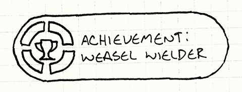
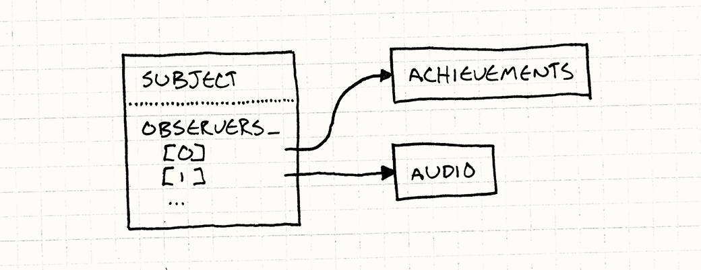
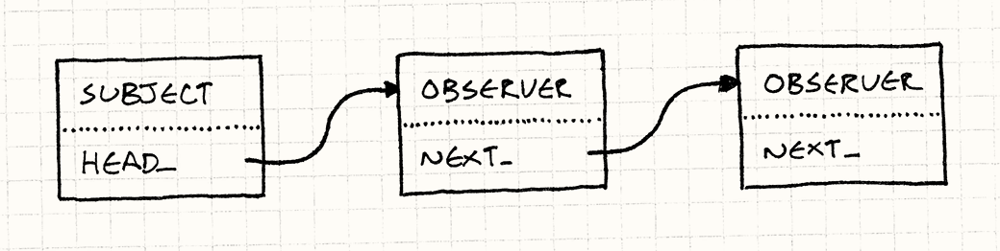
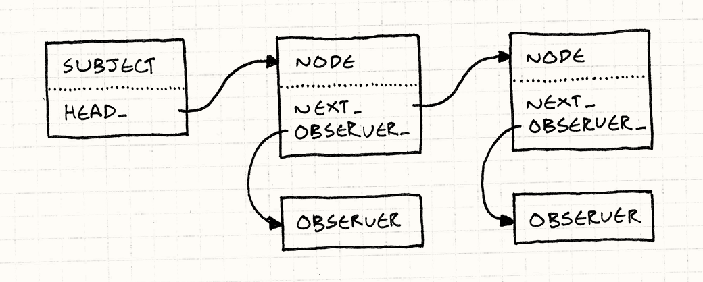

> **Source:** [https://gameprogrammingpatterns.com/observer.html](https://gameprogrammingpatterns.com/observer.html)
> **Section:** Design Patterns Revisited
> **Book:** *Game Programming Patterns* by Robert Nystrom (gameprogrammingpatterns.com)
> **Note:** Mirrored locally for personal study. Not redistributed. Buy the book if you find it useful.

---

# Observer

# [Game Programming Patterns](/)[Design Patterns Revisited](design-patterns-revisited.html)

You can’t throw a rock at a computer without hitting an application built using the [Model-View-Controller](http://en.wikipedia.org/wiki/Model%E2%80%93view%E2%80%93controller) architecture, and underlying that is the Observer pattern. Observer is so pervasive that Java put it in its core library ([`java.util.Observer`](http://docs.oracle.com/javase/7/docs/api/java/util/Observer.html)) and C# baked it right into the *language* (the [`event`](http://msdn.microsoft.com/en-us/library/8627sbea.aspx) keyword).

Like so many things in software, MVC was invented by Smalltalkers in the seventies. Lispers probably claim they came up with it in the sixties but didn’t bother writing it down.

Observer is one of the most widely used and widely known of the original Gang of Four patterns, but the game development world can be strangely cloistered at times, so maybe this is all news to you. In case you haven’t left the abbey in a while, let me walk you through a motivating example.

## <a href="#achievement-unlocked" id="achievement-unlocked">Achievement Unlocked</a>

Say we’re adding an achievements system to our game. It will feature dozens of different badges players can earn for completing specific milestones like “Kill 100 Monkey Demons”, “Fall off a Bridge”, or “Complete a Level Wielding Only a Dead Weasel”.

I swear I had no double meaning in mind when I drew this.

This is tricky to implement cleanly since we have such a wide range of achievements that are unlocked by all sorts of different behaviors. If we aren’t careful, tendrils of our achievement system will twine their way through every dark corner of our codebase. Sure, “Fall off a Bridge” is somehow tied to the physics engine, but do we really want to see a call to `unlockFallOffBridge()` right in the middle of the linear algebra in our collision resolution algorithm?

This is a rhetorical question. No self-respecting physics programmer would ever let us sully their beautiful mathematics with something as pedestrian as *gameplay*.

What we’d like, as always, is to have all the code concerned with one facet of the game nicely lumped in one place. The challenge is that achievements are triggered by a bunch of different aspects of gameplay. How can that work without coupling the achievement code to all of them?

That’s what the observer pattern is for. It lets one piece of code announce that something interesting happened *without actually caring who receives the notification*.

For example, we’ve got some physics code that handles gravity and tracks which bodies are relaxing on nice flat surfaces and which are plummeting toward sure demise. To implement the “Fall off a Bridge” badge, we could just jam the achievement code right in there, but that’s a mess. Instead, we can just do:

    void Physics::updateEntity(Entity& entity)
    {
      bool wasOnSurface = entity.isOnSurface();
      entity.accelerate(GRAVITY);
      entity.update();
      if (wasOnSurface && !entity.isOnSurface())
      {
        notify(entity, EVENT_START_FALL);
      }
    }

All it does is say, “Uh, I don’t know if anyone cares, but this thing just fell. Do with that as you will.”

The physics engine does have to decide what notifications to send, so it isn’t entirely decoupled. But in architecture, we’re most often trying to make systems *better*, not *perfect*.

The achievement system registers itself so that whenever the physics code sends a notification, the achievement system receives it. It can then check to see if the falling body is our less-than-graceful hero, and if his perch prior to this new, unpleasant encounter with classical mechanics was a bridge. If so, it unlocks the proper achievement with associated fireworks and fanfare, and it does all of this with no involvement from the physics code.

In fact, we can change the set of achievements or tear out the entire achievement system without touching a line of the physics engine. It will still send out its notifications, oblivious to the fact that nothing is receiving them anymore.

Of course, if we *permanently* remove achievements and nothing else ever listens to the physics engine’s notifications, we may as well remove the notification code too. But during the game’s evolution, it’s nice to have this flexibility.

## <a href="#how-it-works" id="how-it-works">How it Works</a>

If you don’t already know how to implement the pattern, you could probably guess from the previous description, but to keep things easy on you, I’ll walk through it quickly.

### <a href="#the-observer" id="the-observer">The observer</a>

We’ll start with the nosy class that wants to know when another object does something interesting. These inquisitive objects are defined by this interface:

    class Observer
    {
    public:
      virtual ~Observer() {}
      virtual void onNotify(const Entity& entity, Event event) = 0;
    };

The parameters to `onNotify()` are up to you. That’s why this is the Observer *pattern* and not the Observer “ready-made code you can paste into your game”. Typical parameters are the object that sent the notification and a generic “data” parameter you stuff other details into.

If you’re coding in a language with generics or templates, you’ll probably use them here, but it’s also fine to tailor them to your specific use case. Here, I’m just hardcoding it to take a game entity and an enum that describes what happened.

Any concrete class that implements this becomes an observer. In our example, that’s the achievement system, so we’d have something like so:

    class Achievements : public Observer
    {
    public:
      virtual void onNotify(const Entity& entity, Event event)
      {
        switch (event)
        {
        case EVENT_ENTITY_FELL:
          if (entity.isHero() && heroIsOnBridge_)
          {
            unlock(ACHIEVEMENT_FELL_OFF_BRIDGE);
          }
          break;

          // Handle other events, and update heroIsOnBridge_...
        }
      }

    private:
      void unlock(Achievement achievement)
      {
        // Unlock if not already unlocked...
      }

      bool heroIsOnBridge_;
    };

### <a href="#the-subject" id="the-subject">The subject</a>

The notification method is invoked by the object being observed. In Gang of Four parlance, that object is called the “subject”. It has two jobs. First, it holds the list of observers that are waiting oh-so-patiently for a missive from it:

    class Subject
    {
    private:
      Observer* observers_[MAX_OBSERVERS];
      int numObservers_;
    };

In real code, you would use a dynamically-sized collection instead of a dumb array. I’m sticking with the basics here for people coming from other languages who don’t know C++’s standard library.

The important bit is that the subject exposes a *public* API for modifying that list:

    class Subject
    {
    public:
      void addObserver(Observer* observer)
      {
        // Add to array...
      }

      void removeObserver(Observer* observer)
      {
        // Remove from array...
      }

      // Other stuff...
    };

That allows outside code to control who receives notifications. The subject communicates with the observers, but it isn’t *coupled* to them. In our example, no line of physics code will mention achievements. Yet, it can still talk to the achievements system. That’s the clever part about this pattern.

It’s also important that the subject has a *list* of observers instead of a single one. It makes sure that observers aren’t implicitly coupled to *each other*. For example, say the audio engine also observes the fall event so that it can play an appropriate sound. If the subject only supported one observer, when the audio engine registered itself, that would *un*-register the achievements system.

That means those two systems would interfere with each other — and in a particularly nasty way, since the second would disable the first. Supporting a list of observers ensures that each observer is treated independently from the others. As far as they know, each is the only thing in the world with eyes on the subject.

The other job of the subject is sending notifications:

    class Subject
    {
    protected:
      void notify(const Entity& entity, Event event)
      {
        for (int i = 0; i < numObservers_; i++)
        {
          observers_[i]->onNotify(entity, event);
        }
      }

      // Other stuff...
    };

Note that this code assumes observers don’t modify the list in their `onNotify()` methods. A more robust implementation would either prevent or gracefully handle concurrent modification like that.

### <a href="#observable-physics" id="observable-physics">Observable physics</a>

Now, we just need to hook all of this into the physics engine so that it can send notifications and the achievement system can wire itself up to receive them. We’ll stay close to the original *Design Patterns* recipe and inherit `Subject`:

    class Physics : public Subject
    {
    public:
      void updateEntity(Entity& entity);
    };

This lets us make `notify()` in `Subject` protected. That way the derived physics engine class can call it to send notifications, but code outside of it cannot. Meanwhile, `addObserver()` and `removeObserver()` are public, so anything that can get to the physics system can observe it.

In real code, I would avoid using inheritance here. Instead, I’d make `Physics` *have* an instance of `Subject`. Instead of observing the physics engine itself, the subject would be a separate “falling event” object. Observers could register themselves using something like:

    physics.entityFell()
      .addObserver(this);

To me, this is the difference between “observer” systems and “event” systems. With the former, you observe *the thing that did something interesting*. With the latter, you observe an object that represents *the interesting thing that happened*.

Now, when the physics engine does something noteworthy, it calls `notify()` like in the motivating example before. That walks the observer list and gives them all the heads up.

Pretty simple, right? Just one class that maintains a list of pointers to instances of some interface. It’s hard to believe that something so straightforward is the communication backbone of countless programs and app frameworks.

But the Observer pattern isn’t without its detractors. When I’ve asked other game programmers what they think about this pattern, they bring up a few complaints. Let’s see what we can do to address them, if anything.

## <a href="#it&#39;s-too-slow" id="it&#39;s-too-slow">“It’s Too Slow”</a>

I hear this a lot, often from programmers who don’t actually know the details of the pattern. They have a default assumption that anything that smells like a “design pattern” must involve piles of classes and indirection and other creative ways of squandering CPU cycles.

The Observer pattern gets a particularly bad rap here because it’s been known to hang around with some shady characters named “events”, “messages”, and even “data binding”. Some of those systems *can* be slow (often deliberately, and for good reason). They involve things like queuing or doing dynamic allocation for each notification.

This is why I think documenting patterns is important. When we get fuzzy about terminology, we lose the ability to communicate clearly and succinctly. You say, “Observer”, and someone hears “Events” or “Messaging” because either no one bothered to write down the difference or they didn’t happen to read it.

That’s what I’m trying to do with this book. To cover my bases, I’ve got a chapter on events and messages too: <a href="event-queue.html" class="pattern">Event Queue</a>.

But, now that you’ve seen how the pattern is actually implemented, you know that isn’t the case. Sending a notification is simply walking a list and calling some virtual methods. Granted, it’s a *bit* slower than a statically dispatched call, but that cost is negligible in all but the most performance-critical code.

I find this pattern fits best outside of hot code paths anyway, so you can usually afford the dynamic dispatch. Aside from that, there’s virtually no overhead. We aren’t allocating objects for messages. There’s no queueing. It’s just an indirection over a synchronous method call.

### <a href="#it&#39;s-too-*fast*" id="it&#39;s-too-*fast*">It’s too <em>fast?</em></a>

In fact, you have to be careful because the Observer pattern *is* synchronous. The subject invokes its observers directly, which means it doesn’t resume its own work until all of the observers have returned from their notification methods. A slow observer can block a subject.

This sounds scary, but in practice, it’s not the end of the world. It’s just something you have to be aware of. UI programmers — who’ve been doing event-based programming like this for ages — have a time-worn motto for this: “stay off the UI thread”.

If you’re responding to an event synchronously, you need to finish and return control as quickly as possible so that the UI doesn’t lock up. When you have slow work to do, push it onto another thread or a work queue.

You do have to be careful mixing observers with threading and explicit locks, though. If an observer tries to grab a lock that the subject has, you can deadlock the game. In a highly threaded engine, you may be better off with asynchronous communication using an <a href="event-queue.html" class="pattern">Event Queue</a>.

## <a href="#it-does-too-much-dynamic-allocation" id="it-does-too-much-dynamic-allocation">“It Does Too Much Dynamic Allocation”</a>

Whole tribes of the programmer clan — including many game developers — have moved onto garbage collected languages, and dynamic allocation isn’t the boogie man that it used to be. But for performance-critical software like games, memory allocation still matters, even in managed languages. Dynamic allocation takes time, as does reclaiming memory, even if it happens automatically.

Many game developers are less worried about allocation and more worried about *fragmentation.* When your game needs to run continuously for days without crashing in order to get certified, an increasingly fragmented heap can prevent you from shipping.

The <a href="object-pool.html" class="pattern">Object Pool</a> chapter goes into more detail about this and a common technique for avoiding it.

In the example code before, I used a fixed array because I’m trying to keep things dead simple. In real implementations, the observer list is almost always a dynamically allocated collection that grows and shrinks as observers are added and removed. That memory churn spooks some people.

Of course, the first thing to notice is that it only allocates memory when observers are being wired up. *Sending* a notification requires no memory allocation whatsoever — it’s just a method call. If you hook up your observers at the start of the game and don’t mess with them much, the amount of allocation is minimal.

If it’s still a problem, though, I’ll walk through a way to implement adding and removing observers without any dynamic allocation at all.

### <a href="#linked-observers" id="linked-observers">Linked observers</a>

In the code we’ve seen so far, `Subject` owns a list of pointers to each `Observer` watching it. The `Observer` class itself has no reference to this list. It’s just a pure virtual interface. Interfaces are preferred over concrete, stateful classes, so that’s generally a good thing.

But if we *are* willing to put a bit of state in `Observer`, we can solve our allocation problem by threading the subject’s list *through the observers themselves*. Instead of the subject having a separate collection of pointers, the observer objects become nodes in a linked list:

To implement this, first we’ll get rid of the array in `Subject` and replace it with a pointer to the head of the list of observers:

    class Subject
    {
      Subject()
      : head_(NULL)
      {}

      // Methods...
    private:
      Observer* head_;
    };

Then we’ll extend `Observer` with a pointer to the next observer in the list:

    class Observer
    {
      friend class Subject;

    public:
      Observer()
      : next_(NULL)
      {}

      // Other stuff...
    private:
      Observer* next_;
    };

We’re also making `Subject` a friend class here. The subject owns the API for adding and removing observers, but the list it will be managing is now inside the `Observer` class itself. The simplest way to give it the ability to poke at that list is by making it a friend.

Registering a new observer is just wiring it into the list. We’ll take the easy option and insert it at the front:

    void Subject::addObserver(Observer* observer)
    {
      observer->next_ = head_;
      head_ = observer;
    }

The other option is to add it to the end of the linked list. Doing that adds a bit more complexity. `Subject` has to either walk the list to find the end or keep a separate `tail_` pointer that always points to the last node.

Adding it to the front of the list is simpler, but does have one side effect. When we walk the list to send a notification to every observer, the most *recently* registered observer gets notified *first*. So if you register observers A, B, and C, in that order, they will receive notifications in C, B, A order.

In theory, this doesn’t matter one way or the other. It’s a tenet of good observer discipline that two observers observing the same subject should have no ordering dependencies relative to each other. If the ordering *does* matter, it means those two observers have some subtle coupling that could end up biting you.

Let’s get removal working:

    void Subject::removeObserver(Observer* observer)
    {
      if (head_ == observer)
      {
        head_ = observer->next_;
        observer->next_ = NULL;
        return;
      }

      Observer* current = head_;
      while (current != NULL)
      {
        if (current->next_ == observer)
        {
          current->next_ = observer->next_;
          observer->next_ = NULL;
          return;
        }

        current = current->next_;
      }
    }

Removing a node from a linked list usually requires a bit of ugly special case handling for removing the very first node, like you see here. There’s a more elegant solution using a pointer to a pointer.

I didn’t do that here because it confuses at least half the people I show it to. It’s a worthwhile exercise for you to do, though: It helps you really think in terms of pointers.

Because we have a singly linked list, we have to walk it to find the observer we’re removing. We’d have to do the same thing if we were using a regular array for that matter. If we use a *doubly* linked list, where each observer has a pointer to both the observer after it and before it, we can remove an observer in constant time. If this were real code, I’d do that.

The only thing left to do is send a notification. That’s as simple as walking the list:

    void Subject::notify(const Entity& entity, Event event)
    {
      Observer* observer = head_;
      while (observer != NULL)
      {
        observer->onNotify(entity, event);
        observer = observer->next_;
      }
    }

Here, we walk the entire list and notify every single observer in it. This ensures that all of the observers get equal priority and are independent of each other.

We could tweak this such that when an observer is notified, it can return a flag indicating whether the subject should keep walking the list or stop. If you do that, you’re pretty close to having the <a href="http://en.wikipedia.org/wiki%0A/Chain-of-responsibility_pattern" class="gof-pattern">Chain of Responsibility</a> pattern.

Not too bad, right? A subject can have as many observers as it wants, without a single whiff of dynamic memory. Registering and unregistering is as fast as it was with a simple array. We have sacrificed one small feature, though.

Since we are using the observer object itself as a list node, that implies it can only be part of one subject’s observer list. In other words, an observer can only observe a single subject at a time. In a more traditional implementation where each subject has its own independent list, an observer can be in more than one of them simultaneously.

You may be able to live with that limitation. I find it more common for a *subject* to have multiple *observers* than vice versa. If it *is* a problem for you, there is another more complex solution you can use that still doesn’t require dynamic allocation. It’s too long to cram into this chapter, but I’ll sketch it out and let you fill in the blanks…

### <a href="#a-pool-of-list-nodes" id="a-pool-of-list-nodes">A pool of list nodes</a>

Like before, each subject will have a linked list of observers. However, those list nodes won’t be the observer objects themselves. Instead, they’ll be separate little “list node” objects that contain a pointer to the observer and then a pointer to the next node in the list.

Since multiple nodes can all point to the same observer, that means an observer can be in more than one subject’s list at the same time. We’re back to being able to observe multiple subjects simultaneously.

Linked lists come in two flavors. In the one you learned in school, you have a node object that contains the data. In our previous linked observer example, that was flipped around: the *data* (in this case the observer) contained the *node* (i.e. the `next_` pointer).

The latter style is called an “intrusive” linked list because using an object in a list intrudes into the definition of that object itself. That makes intrusive lists less flexible but, as we’ve seen, also more efficient. They’re popular in places like the Linux kernel where that trade-off makes sense.

The way you avoid dynamic allocation is simple: since all of those nodes are the same size and type, you pre-allocate an <a href="object-pool.html" class="pattern">object pool</a> of them. That gives you a fixed-size pile of list nodes to work with, and you can use and reuse them as you need without having to hit an actual memory allocator.

## <a href="#remaining-problems" id="remaining-problems">Remaining Problems</a>

I think we’ve banished the three boogie men used to scare people off this pattern. As we’ve seen, it’s simple, fast, and can be made to play nice with memory management. But does that mean you should use observers all the time?

Now, that’s a different question. Like all design patterns, the Observer pattern isn’t a cure-all. Even when implemented correctly and efficiently, it may not be the right solution. The reason design patterns get a bad rap is because people apply good patterns to the wrong problem and end up making things worse.

Two challenges remain, one technical and one at something more like the maintainability level. We’ll do the technical one first because those are always easiest.

### <a href="#destroying-subjects-and-observers" id="destroying-subjects-and-observers">Destroying subjects and observers</a>

The sample code we walked through is solid, but it side-steps an important issue: what happens when you delete a subject or an observer? If you carelessly call `delete` on some observer, a subject may still have a pointer to it. That’s now a dangling pointer into deallocated memory. When that subject tries to send a notification, well… let’s just say you’re not going to have a good time.

Not to point fingers, but I’ll note that *Design Patterns* doesn’t mention this issue at all.

Destroying the subject is easier since in most implementations, the observer doesn’t have any references to it. But even then, sending the subject’s bits to the memory manager’s recycle bin may cause some problems. Those observers may still be expecting to receive notifications in the future, and they don’t know that that will never happen now. They aren’t observers at all, really, they just think they are.

You can deal with this in a couple of different ways. The simplest is to do what I did and just punt on it. It’s an observer’s job to unregister itself from any subjects when it gets deleted. More often than not, the observer *does* know which subjects it’s observing, so it’s usually just a matter of adding a `removeObserver()` call to its destructor.

As is often the case, the hard part isn’t doing it, it’s *remembering* to do it.

If you don’t want to leave observers hanging when a subject gives up the ghost, that’s easy to fix. Just have the subject send one final “dying breath” notification right before it gets destroyed. That way, any observer can receive that and take whatever action it thinks is appropriate.

Mourn, send flowers, compose elegy, etc.

People — even those of us who’ve spent enough time in the company of machines to have some of their precise nature rub off on us — are reliably terrible at being reliable. That’s why we invented computers: they don’t make the mistakes we so often do.

A safer answer is to make observers automatically unregister themselves from every subject when they get destroyed. If you implement the logic for that once in your base observer class, everyone using it doesn’t have to remember to do it themselves. This does add some complexity, though. It means each *observer* will need a list of the *subjects* it’s observing. You end up with pointers going in both directions.

### <a href="#don&#39;t-worry,-i&#39;ve-got-a-gc" id="don&#39;t-worry,-i&#39;ve-got-a-gc">Don’t worry, I’ve got a GC</a>

All you cool kids with your hip modern languages with garbage collectors are feeling pretty smug right now. Think you don’t have to worry about this because you never explicitly delete anything? Think again!

Imagine this: you’ve got some UI screen that shows a bunch of stats about the player’s character like their health and stuff. When the player brings up the screen, you instantiate a new object for it. When they close it, you just forget about the object and let the GC clean it up.

Every time the character takes a punch to the face (or elsewhere, I suppose), it sends a notification. The UI screen observes that and updates the little health bar. Great. Now what happens when the player dismisses the screen, but you don’t unregister the observer?

The UI isn’t visible anymore, but it won’t get garbage collected since the character’s observer list still has a reference to it. Every time the screen is loaded, we add a new instance of it to that increasingly long list.

The entire time the player is playing the game, running around, and getting in fights, the character is sending notifications that get received by *all* of those screens. They aren’t on screen, but they receive notifications and waste CPU cycles updating invisible UI elements. If they do other things like play sounds, you’ll get noticeably wrong behavior.

This is such a common issue in notification systems that it has a name: the *lapsed listener problem*. Since subjects retain references to their listeners, you can end up with zombie UI objects lingering in memory. The lesson here is to be disciplined about unregistration.

An even surer sign of its significance: it has [a Wikipedia article](http://en.wikipedia.org/wiki/Lapsed_listener_problem).

### <a href="#what&#39;s-going-on" id="what&#39;s-going-on">What’s going on?</a>

The other, deeper issue with the Observer pattern is a direct consequence of its intended purpose. We use it because it helps us loosen the coupling between two pieces of code. It lets a subject indirectly communicate with some observer without being statically bound to it.

This is a real win when you’re trying to reason about the subject’s behavior, and any hangers-on would be an annoying distraction. If you’re poking at the physics engine, you really don’t want your editor — or your mind — cluttered up with a bunch of stuff about achievements.

On the other hand, if your program isn’t working and the bug spans some chain of observers, reasoning about that communication flow is much more difficult. With an explicit coupling, it’s as easy as looking up the method being called. This is child’s play for your average IDE since the coupling is static.

But if that coupling happens through an observer list, the only way to tell who will get notified is by seeing which observers happen to be in that list *at runtime*. Instead of being able to *statically* reason about the communication structure of the program, you have to reason about its *imperative, dynamic* behavior.

My guideline for how to cope with this is pretty simple. If you often need to think about *both* sides of some communication in order to understand a part of the program, don’t use the Observer pattern to express that linkage. Prefer something more explicit.

When you’re hacking on some big program, you tend to have lumps of it that you work on all together. We have lots of terminology for this like “separation of concerns” and “coherence and cohesion” and “modularity”, but it boils down to “this stuff goes together and doesn’t go with this other stuff”.

The observer pattern is a great way to let those mostly unrelated lumps talk to each other without them merging into one big lump. It’s less useful *within* a single lump of code dedicated to one feature or aspect.

That’s why it fits our example well: achievements and physics are almost entirely unrelated domains, likely implemented by different people. We want the bare minimum of communication between them so that working on either one doesn’t require much knowledge of the other.

## <a href="#observers-today" id="observers-today">Observers Today</a>

*Design Patterns* came out in 1994. Back then, object-oriented programming was *the* hot paradigm. Every programmer on Earth wanted to “Learn OOP in 30 Days,” and middle managers paid them based on the number of classes they created. Engineers judged their mettle by the depth of their inheritance hierarchies.

That same year, Ace of Base had not one but *three* hit singles, so that may tell you something about our taste and discernment back then.

The Observer pattern got popular during that zeitgeist, so it’s no surprise that it’s class-heavy. But mainstream coders now are more comfortable with functional programming. Having to implement an entire interface just to receive a notification doesn’t fit today’s aesthetic.

It feels heavyweight and rigid. It *is* heavyweight and rigid. For example, you can’t have a single class that uses different notification methods for different subjects.

This is why the subject usually passes itself to the observer. Since an observer only has a single `onNotify()` method, if it’s observing multiple subjects, it needs to be able to tell which one called it.

A more modern approach is for an “observer” to be only a reference to a method or function. In languages with first-class functions, and especially ones with closures, this is a much more common way to do observers.

These days, practically *every* language has closures. C++ overcame the challenge of closures in a language without garbage collection, and even Java finally got its act together and introduced them in JDK 8.

For example, C# has “events” baked into the language. With those, the observer you register is a “delegate”, which is that language’s term for a reference to a method. In JavaScript’s event system, observers *can* be objects supporting a special `EventListener` protocol, but they can also just be functions. The latter is almost always what people use.

If I were designing an observer system today, I’d make it function-based instead of class-based. Even in C++, I would tend toward a system that let you register member function pointers as observers instead of instances of some `Observer` interface.

[Here’s](http://molecularmusings.wordpress.com/2011/09/19/generic-type-safe-delegates-and-events-in-c/) an interesting blog post on one way to implement this in C++.

## <a href="#observers-tomorrow" id="observers-tomorrow">Observers Tomorrow</a>

Event systems and other observer-like patterns are incredibly common these days. They’re a well-worn path. But if you write a few large apps using them, you start to notice something. A lot of the code in your observers ends up looking the same. It’s usually something like:

1.  Get notified that some state has changed.

2.  Imperatively modify some chunk of UI to reflect the new state.

It’s all, “Oh, the hero health is 7 now? Let me set the width of the health bar to 70 pixels.” After a while, that gets pretty tedious. Computer science academics and software engineers have been trying to eliminate that tedium for a *long* time. Their attempts have gone under a number of different names: “dataflow programming”, “functional reactive programming”, etc.

While there have been some successes, usually in limited domains like audio processing or chip design, the Holy Grail still hasn’t been found. In the meantime, a less ambitious approach has started gaining traction. Many recent application frameworks now use “data binding”.

Unlike more radical models, data binding doesn’t try to entirely eliminate imperative code and doesn’t try to architect your entire application around a giant declarative dataflow graph. What it does do is automate the busywork where you’re tweaking a UI element or calculated property to reflect a change to some value.

Like other declarative systems, data binding is probably a bit too slow and complex to fit inside the core of a game engine. But I would be surprised if I didn’t see it start making inroads into less critical areas of the game like UI.

In the meantime, the good old Observer pattern will still be here waiting for us. Sure, it’s not as exciting as some hot technique that manages to cram both “functional” and “reactive” in its name, but it’s dead simple and it works. To me, those are often the two most important criteria for a solution.

← [Previous Chapter](flyweight.html)

 

≡ [About The Book](/)

 

§ [Contents](/contents.html)

 

[Next Chapter](prototype.html) →

© 2009-2021 Robert Nystrom
