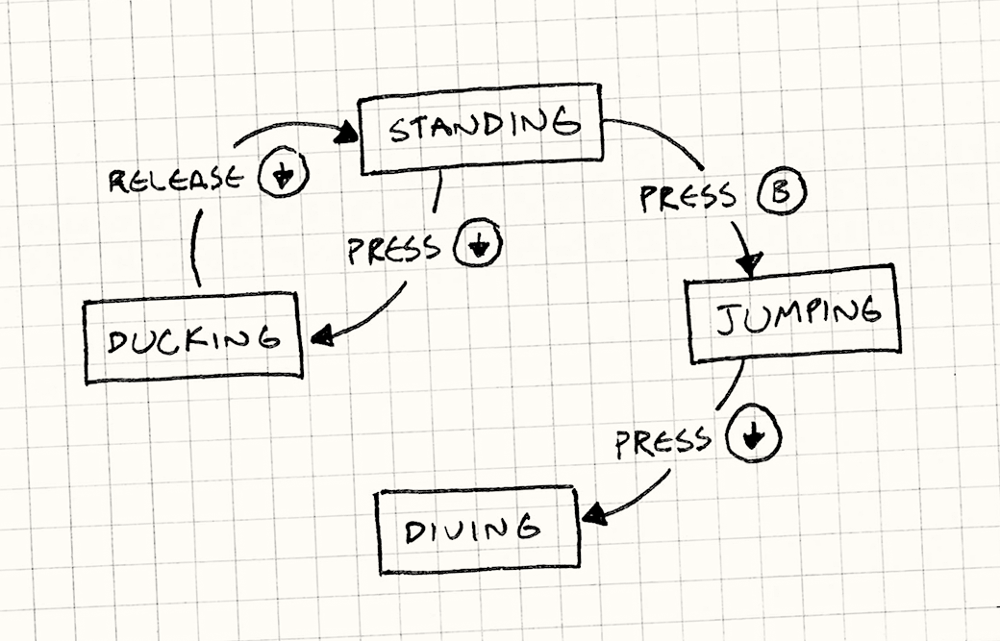
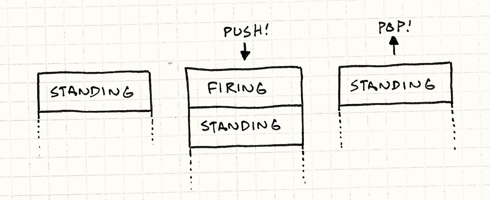

> **Source:** [https://gameprogrammingpatterns.com/state.html](https://gameprogrammingpatterns.com/state.html)
> **Section:** Design Patterns Revisited
> **Book:** *Game Programming Patterns* by Robert Nystrom (gameprogrammingpatterns.com)
> **Note:** Mirrored locally for personal study. Not redistributed. Buy the book if you find it useful.

---

# State

# [Game Programming Patterns](/)[Design Patterns Revisited](design-patterns-revisited.html)

Confession time: I went a little overboard and packed way too much into this chapter. It’s ostensibly about the <a href="http://en.wikipedia.org/wiki/State_pattern" class="gof-pattern">State</a> design pattern, but I can’t talk about that and games without going into the more fundamental concept of *finite state machines* (or “FSMs”). But then once I went there, I figured I might as well introduce *hierarchical state machines* and *pushdown automata*.

That’s a lot to cover, so to keep things as short as possible, the code samples here leave out a few details that you’ll have to fill in on your own. I hope they’re still clear enough for you to get the big picture.

Don’t feel sad if you’ve never heard of a state machine. While well known to AI and compiler hackers, they aren’t that familiar to other programming circles. I think they should be more widely known, so I’m going to throw them at a different kind of problem here.

This pairing echoes the early days of artificial intelligence. In the ’50s and ’60s, much of AI research was focused on language processing. Many of the techniques compilers now use for parsing programming languages were invented for parsing human languages.

## <a href="#we&#39;ve-all-been-there" id="we&#39;ve-all-been-there">We’ve All Been There</a>

We’re working on a little side-scrolling platformer. Our job is to implement the heroine that is the player’s avatar in the game world. That means making her respond to user input. Push the B button and she should jump. Simple enough:

    void Heroine::handleInput(Input input)
    {
      if (input == PRESS_B)
      {
        yVelocity_ = JUMP_VELOCITY;
        setGraphics(IMAGE_JUMP);
      }
    }

Spot the bug?

There’s nothing to prevent “air jumping” — keep hammering B while she’s in the air, and she will float forever. The simple fix is to add an `isJumping_` Boolean field to `Heroine` that tracks when she’s jumping, and then do:

    void Heroine::handleInput(Input input)
    {
      if (input == PRESS_B)
      {
        if (!isJumping_)
        {
          isJumping_ = true;
          // Jump...
        }
      }
    }

There should also be code that sets `isJumping_` back to `false` when the heroine touches the ground. I’ve omitted that here for brevity’s sake.

Next, we want the heroine to duck if the player presses down while she’s on the ground and stand back up when the button is released:

    void Heroine::handleInput(Input input)
    {
      if (input == PRESS_B)
      {
        // Jump if not jumping...
      }
      else if (input == PRESS_DOWN)
      {
        if (!isJumping_)
        {
          setGraphics(IMAGE_DUCK);
        }
      }
      else if (input == RELEASE_DOWN)
      {
        setGraphics(IMAGE_STAND);
      }
    }

Spot the bug this time?

With this code, the player could:

1.  Press down to duck.
2.  Press B to jump from a ducking position.
3.  Release down while still in the air.

The heroine will switch to her standing graphic in the middle of the jump. Time for another flag…

    void Heroine::handleInput(Input input)
    {
      if (input == PRESS_B)
      {
        if (!isJumping_ && !isDucking_)
        {
          // Jump...
        }
      }
      else if (input == PRESS_DOWN)
      {
        if (!isJumping_)
        {
          isDucking_ = true;
          setGraphics(IMAGE_DUCK);
        }
      }
      else if (input == RELEASE_DOWN)
      {
        if (isDucking_)
        {
          isDucking_ = false;
          setGraphics(IMAGE_STAND);
        }
      }
    }

Next, it would be cool if the heroine did a dive attack if the player presses down in the middle of a jump:

    void Heroine::handleInput(Input input)
    {
      if (input == PRESS_B)
      {
        if (!isJumping_ && !isDucking_)
        {
          // Jump...
        }
      }
      else if (input == PRESS_DOWN)
      {
        if (!isJumping_)
        {
          isDucking_ = true;
          setGraphics(IMAGE_DUCK);
        }
        else
        {
          isJumping_ = false;
          setGraphics(IMAGE_DIVE);
        }
      }
      else if (input == RELEASE_DOWN)
      {
        if (isDucking_)
        {
          // Stand...
        }
      }
    }

Bug hunting time again. Find it?

We check that you can’t air jump while jumping, but not while diving. Yet another field…

Something is clearly wrong with our approach. Every time we touch this handful of code, we break something. We need to add a bunch more moves — we haven’t even added *walking* yet — but at this rate, it will collapse into a heap of bugs before we’re done with it.

Those coders you idolize who always seem to create flawless code aren’t simply superhuman programmers. Instead, they have an intuition about which *kinds* of code are error-prone, and they steer away from them.

Complex branching and mutable state — fields that change over time — are two of those error-prone kinds of code, and the examples above have both.

## <a href="#finite-state-machines-to-the-rescue" id="finite-state-machines-to-the-rescue">Finite State Machines to the Rescue</a>

In a fit of frustration, you sweep everything off your desk except a pen and paper and start drawing a flowchart. You draw a box for each thing the heroine can be doing: standing, jumping, ducking, and diving. When she can respond to a button press in one of those states, you draw an arrow from that box, label it with that button, and connect it to the state she changes to.

Congratulations, you’ve just created a *finite state machine*. These came out of a branch of computer science called *automata theory* whose family of data structures also includes the famous Turing machine. FSMs are the simplest member of that family.

The gist is:

- **You have a fixed *set of states* that the machine can be in.** For our example, that’s standing, jumping, ducking, and diving.

- **The machine can only be in *one* state at a time.** Our heroine can’t be jumping and standing simultaneously. In fact, preventing that is one reason we’re going to use an FSM.

- **A sequence of *inputs* or *events* is sent to the machine.** In our example, that’s the raw button presses and releases.

- **Each state has a *set of transitions*, each associated with an input and pointing to a state.** When an input comes in, if it matches a transition for the current state, the machine changes to the state that transition points to.

  For example, pressing down while standing transitions to the ducking state. Pressing down while jumping transitions to diving. If no transition is defined for an input on the current state, the input is ignored.

In their pure form, that’s the whole banana: states, inputs, and transitions. You can draw it out like a little flowchart. Unfortunately, the compiler doesn’t recognize our scribbles, so how do we go about *implementing* one? The Gang of Four’s State pattern is one method — which we’ll get to — but let’s start simpler.

My favorite analogy for FSMs is the old text adventure games like Zork. You have a world of rooms that are connected to each other by exits. You explore them by entering commands like “go north”.

This maps directly to a state machine: Each room is a state. The room you’re in is the current state. Each room’s exits are its transitions. The navigation commands are the inputs.

## <a href="#enums-and-switches" id="enums-and-switches">Enums and Switches</a>

One problem our `Heroine` class has is some combinations of those Boolean fields aren’t valid: `isJumping_` and `isDucking_` should never both be true, for example. When you have a handful of flags where only one is `true` at a time, that’s a hint that what you really want is an `enum`.

In this case, that `enum` is exactly the set of states for our FSM, so let’s define that:

    enum State
    {
      STATE_STANDING,
      STATE_JUMPING,
      STATE_DUCKING,
      STATE_DIVING
    };

Instead of a bunch of flags, `Heroine` will just have one `state_` field. We also flip the order of our branching. In the previous code, we switched on input, *then* on state. This kept the code for handling one button press together, but it smeared around the code for one state. We want to keep that together, so we switch on state first. That gives us:

    void Heroine::handleInput(Input input)
    {
      switch (state_)
      {
        case STATE_STANDING:
          if (input == PRESS_B)
          {
            state_ = STATE_JUMPING;
            yVelocity_ = JUMP_VELOCITY;
            setGraphics(IMAGE_JUMP);
          }
          else if (input == PRESS_DOWN)
          {
            state_ = STATE_DUCKING;
            setGraphics(IMAGE_DUCK);
          }
          break;

        case STATE_JUMPING:
          if (input == PRESS_DOWN)
          {
            state_ = STATE_DIVING;
            setGraphics(IMAGE_DIVE);
          }
          break;

        case STATE_DUCKING:
          if (input == RELEASE_DOWN)
          {
            state_ = STATE_STANDING;
            setGraphics(IMAGE_STAND);
          }
          break;
      }
    }

This seems trivial, but it’s a real improvement over the previous code. We still have some conditional branching, but we simplified the mutable state to a single field. All of the code for handling a single state is now nicely lumped together. This is the simplest way to implement a state machine and is fine for some uses.

In particular, the heroine can no longer be in an *invalid* state. With the Boolean flags, some sets of values were possible but meaningless. With the `enum`, each value is valid.

Your problem may outgrow this solution, though. Say we want to add a move where our heroine can duck for a while to charge up and unleash a special attack. While she’s ducking, we need to track the charge time.

We add a `chargeTime_` field to `Heroine` to store how long the attack has charged. Assume we already have an `update()` that gets called each frame. In there, we add:

    void Heroine::update()
    {
      if (state_ == STATE_DUCKING)
      {
        chargeTime_++;
        if (chargeTime_ > MAX_CHARGE)
        {
          superBomb();
        }
      }
    }

If you guessed that this is the <a href="update-method.html" class="pattern">Update Method</a> pattern, you win a prize!

We need to reset the timer when she starts ducking, so we modify `handleInput()`:

    void Heroine::handleInput(Input input)
    {
      switch (state_)
      {
        case STATE_STANDING:
          if (input == PRESS_DOWN)
          {
            state_ = STATE_DUCKING;
            chargeTime_ = 0;
            setGraphics(IMAGE_DUCK);
          }
          // Handle other inputs...
          break;

          // Other states...
      }
    }

All in all, to add this charge attack, we had to modify two methods and add a `chargeTime_` field onto `Heroine` even though it’s only meaningful while in the ducking state. What we’d prefer is to have all of that code and data nicely wrapped up in one place. The Gang of Four has us covered.

## <a href="#the-state-pattern" id="the-state-pattern">The State Pattern</a>

For people deeply into the object-oriented mindset, every conditional branch is an opportunity to use dynamic dispatch (in other words a virtual method call in C++). I think you can go too far down that rabbit hole. Sometimes an `if` is all you need.

There’s a historical basis for this. Many of the original object-oriented apostles like *Design Patterns*‘ Gang of Four, and *Refactoring*‘s Martin Fowler came from Smalltalk. There, `ifThen:` is just a method you invoke on the condition, which is implemented differently by the `true` and `false` objects.

But in our example, we’ve reached a tipping point where something object-oriented is a better fit. That gets us to the State pattern. In the words of the Gang of Four:

> Allow an object to alter its behavior when its internal state changes. The object will appear to change its class.

That doesn’t tell us much. Heck, our `switch` does that. The concrete pattern they describe looks like this when applied to our heroine:

### <a href="#a-state-interface" id="a-state-interface">A state interface</a>

First, we define an interface for the state. Every bit of behavior that is state-dependent — every place we had a `switch` before — becomes a virtual method in that interface. For us, that’s `handleInput()` and `update()`:

    class HeroineState
    {
    public:
      virtual ~HeroineState() {}
      virtual void handleInput(Heroine& heroine, Input input) {}
      virtual void update(Heroine& heroine) {}
    };

### <a href="#classes-for-each-state" id="classes-for-each-state">Classes for each state</a>

For each state, we define a class that implements the interface. Its methods define the heroine’s behavior when in that state. In other words, take each `case` from the earlier `switch` statements and move them into their state’s class. For example:

    class DuckingState : public HeroineState
    {
    public:
      DuckingState()
      : chargeTime_(0)
      {}

      virtual void handleInput(Heroine& heroine, Input input) {
        if (input == RELEASE_DOWN)
        {
          // Change to standing state...
          heroine.setGraphics(IMAGE_STAND);
        }
      }

      virtual void update(Heroine& heroine) {
        chargeTime_++;
        if (chargeTime_ > MAX_CHARGE)
        {
          heroine.superBomb();
        }
      }

    private:
      int chargeTime_;
    };

Note that we also moved `chargeTime_` out of `Heroine` and into the `DuckingState` class. This is great — that piece of data is only meaningful while in that state, and now our object model reflects that explicitly.

### <a href="#delegate-to-the-state" id="delegate-to-the-state">Delegate to the state</a>

Next, we give the `Heroine` a pointer to her current state, lose each big `switch`, and delegate to the state instead:

    class Heroine
    {
    public:
      virtual void handleInput(Input input)
      {
        state_->handleInput(*this, input);
      }

      virtual void update()
      {
        state_->update(*this);
      }

      // Other methods...
    private:
      HeroineState* state_;
    };

In order to “change state”, we just need to assign `state_` to point to a different `HeroineState` object. That’s the State pattern in its entirety.

This looks like the <a href="http://en.wikipedia.org/wiki/Strategy_pattern" class="gof-pattern">Strategy</a> and <a href="type-object.html" class="pattern">Type Object</a> patterns. In all three, you have a main object that delegates to another subordinate one. The difference is *intent*.

- With Strategy, the goal is to *decouple* the main class from some portion of its behavior.

- With Type Object, the goal is to make a *number* of objects behave similarly by *sharing* a reference to the same type object.

- With State, the goal is for the main object to *change* its behavior by *changing* the object it delegates to.

## <a href="#where-are-the-state-objects" id="where-are-the-state-objects">Where Are the State Objects?</a>

I did gloss over one bit here. To change states, we need to assign `state_` to point to the new one, but where does that object come from? With our `enum` implementation, that was a no-brainer — `enum` values are primitives like numbers. But now our states are classes, which means we need an actual instance to point to. There are two common answers to this:

### <a href="#static-states" id="static-states">Static states</a>

If the state object doesn’t have any other fields, then the only data it stores is a pointer to the internal virtual method table so that its methods can be called. In that case, there’s no reason to ever have more than one instance of it. Every instance would be identical anyway.

If your state has no fields and only *one* virtual method in it, you can simplify this pattern even more. Replace each state *class* with a state *function* — just a plain vanilla top-level function. Then, the `state_` field in your main class becomes a simple function pointer.

In that case, you can make a single *static* instance. Even if you have a bunch of FSMs all going at the same time in that same state, they can all point to the same instance since it has nothing machine-specific about it.

This is the <a href="flyweight.html" class="gof-pattern">Flyweight</a> pattern.

*Where* you put that static instance is up to you. Find a place that makes sense. For no particular reason, let’s put ours inside the base state class:

    class HeroineState
    {
    public:
      static StandingState standing;
      static DuckingState ducking;
      static JumpingState jumping;
      static DivingState diving;

      // Other code...
    };

Each of those static fields is the one instance of that state that the game uses. To make the heroine jump, the standing state would do something like:

    if (input == PRESS_B)
    {
      heroine.state_ = &HeroineState::jumping;
      heroine.setGraphics(IMAGE_JUMP);
    }

### <a href="#instantiated-states" id="instantiated-states">Instantiated states</a>

Sometimes, though, this doesn’t fly. A static state won’t work for the ducking state. It has a `chargeTime_` field, and that’s specific to the heroine that happens to be ducking. This may coincidentally work in our game if there’s only one heroine, but if we try to add two-player co-op and have two heroines on screen at the same time, we’ll have problems.

In that case, we have to create a state object when we transition to it. This lets each FSM have its own instance of the state. Of course, if we’re allocating a *new* state, that means we need to free the *current* one. We have to be careful here, since the code that’s triggering the change is in a method in the current state. We don’t want to delete `this` out from under ourselves.

Instead, we’ll allow `handleInput()` in `HeroineState` to optionally return a new state. When it does, `Heroine` will delete the old one and swap in the new one, like so:

    void Heroine::handleInput(Input input)
    {
      HeroineState* state = state_->handleInput(*this, input);
      if (state != NULL)
      {
        delete state_;
        state_ = state;
      }
    }

That way, we don’t delete the previous state until we’ve returned from its method. Now, the standing state can transition to ducking by creating a new instance:

    HeroineState* StandingState::handleInput(Heroine& heroine,
                                             Input input)
    {
      if (input == PRESS_DOWN)
      {
        // Other code...
        return new DuckingState();
      }

      // Stay in this state.
      return NULL;
    }

When I can, I prefer to use static states since they don’t burn memory and CPU cycles allocating objects each state change. For states that are more, uh, *stateful*, though, this is the way to go.

When you dynamically allocate states, you may have to worry about fragmentation. The <a href="object-pool.html" class="pattern">Object Pool</a> pattern can help.

## <a href="#enter-and-exit-actions" id="enter-and-exit-actions">Enter and Exit Actions</a>

The goal of the State pattern is to encapsulate all of the behavior and data for one state in a single class. We’re partway there, but we still have some loose ends.

When the heroine changes state, we also switch her sprite. Right now, that code is owned by the state she’s switching *from*. When she goes from ducking to standing, the ducking state sets her image:

    HeroineState* DuckingState::handleInput(Heroine& heroine,
                                            Input input)
    {
      if (input == RELEASE_DOWN)
      {
        heroine.setGraphics(IMAGE_STAND);
        return new StandingState();
      }

      // Other code...
    }

What we really want is each state to control its own graphics. We can handle that by giving the state an *entry action*:

    class StandingState : public HeroineState
    {
    public:
      virtual void enter(Heroine& heroine)
      {
        heroine.setGraphics(IMAGE_STAND);
      }

      // Other code...
    };

Back in `Heroine`, we modify the code for handling state changes to call that on the new state:

    void Heroine::handleInput(Input input)
    {
      HeroineState* state = state_->handleInput(*this, input);
      if (state != NULL)
      {
        delete state_;
        state_ = state;

        // Call the enter action on the new state.
        state_->enter(*this);
      }
    }

This lets us simplify the ducking code to:

    HeroineState* DuckingState::handleInput(Heroine& heroine,
                                            Input input)
    {
      if (input == RELEASE_DOWN)
      {
        return new StandingState();
      }

      // Other code...
    }

All it does is switch to standing and the standing state takes care of the graphics. Now our states really are encapsulated. One particularly nice thing about entry actions is that they run when you enter the state regardless of which state you’re coming *from*.

Most real-world state graphs have multiple transitions into the same state. For example, our heroine will also end up standing after she lands a jump or dive. That means we would end up duplicating some code everywhere that transition occurs. Entry actions give us a place to consolidate that.

We can, of course, also extend this to support an *exit action*. This is just a method we call on the state we’re *leaving* right before we switch to the new state.

## <a href="#what&#39;s-the-catch" id="what&#39;s-the-catch">What’s the Catch?</a>

I’ve spent all this time selling you on FSMs, and now I’m going to pull the rug out from under you. Everything I’ve said so far is true, and FSMs are a good fit for some problems. But their greatest virtue is also their greatest flaw.

State machines help you untangle hairy code by enforcing a very constrained structure on it. All you’ve got is a fixed set of states, a single current state, and some hardcoded transitions.

A finite state machine isn’t even *Turing complete*. Automata theory describes computation using a series of abstract models, each more complex than the previous. A *Turing machine* is one of the most expressive models.

“Turing complete” means a system (usually a programming language) is powerful enough to implement a Turing machine in it, which means all Turing complete languages are, in some ways, equally expressive. FSMs are not flexible enough to be in that club.

If you try using a state machine for something more complex like game AI, you will slam face-first into the limitations of that model. Thankfully, our forebears have found ways to dodge some of those barriers. I’ll close this chapter out by walking you through a couple of them.

## <a href="#concurrent-state-machines" id="concurrent-state-machines">Concurrent State Machines</a>

We’ve decided to give our heroine the ability to carry a gun. When she’s packing heat, she can still do everything she could before: run, jump, duck, etc. But she also needs to be able to fire her weapon while doing it.

If we want to stick to the confines of an FSM, we have to *double* the number of states we have. For each existing state, we’ll need another one for doing the same thing while she’s armed: standing, standing with gun, jumping, jumping with gun, you get the idea.

Add a couple of more weapons and the number of states explodes combinatorially. Not only is it a huge number of states, it’s a huge amount of redundancy: the unarmed and armed states are almost identical except for the little bit of code to handle firing.

The problem is that we’ve jammed two pieces of state — what she’s *doing* and what she’s *carrying* — into a single machine. To model all possible combinations, we would need a state for each *pair*. The fix is obvious: have two separate state machines.

If we want to cram *n* states for what she’s doing and *m* states for what she’s carrying into a single machine, we need *n × m* states. With two machines, it’s just *n + m*.

We keep our original state machine for what she’s doing and leave it alone. Then we define a separate state machine for what she’s carrying. `Heroine` will have *two* “state” references, one for each, like:

    class Heroine
    {
      // Other code...

    private:
      HeroineState* state_;
      HeroineState* equipment_;
    };

For illustrative purposes, we’re using the full State pattern for her equipment. In practice, since it only has two states, a Boolean flag would work too.

When the heroine delegates inputs to the states, she hands it to both of them:

    void Heroine::handleInput(Input input)
    {
      state_->handleInput(*this, input);
      equipment_->handleInput(*this, input);
    }

A more full-featured system would probably have a way for one state machine to *consume* an input so that the other doesn’t receive it. That would prevent both machines from erroneously trying to respond to the same input.

Each state machine can then respond to inputs, spawn behavior, and change its state independently of the other machine. When the two sets of states are mostly unrelated, this works well.

In practice, you’ll find a few cases where the states do interact. For example, maybe she can’t fire while jumping, or maybe she can’t do a dive attack if she’s armed. To handle that, in the code for one state, you’ll probably just do some crude `if` tests on the *other* machine’s state to coordinate them. It’s not the most elegant solution, but it gets the job done.

## <a href="#hierarchical-state-machines" id="hierarchical-state-machines">Hierarchical State Machines</a>

After fleshing out our heroine’s behavior some more, she’ll likely have a bunch of similar states. For example, she may have standing, walking, running, and sliding states. In any of those, pressing B jumps and pressing down ducks.

With a simple state machine implementation, we have to duplicate that code in each of those states. It would be better if we could implement that once and reuse it across all of the states.

If this was just object-oriented code instead of a state machine, one way to share code across those states would be using inheritance. We could define a class for an “on ground” state that handles jumping and ducking. Standing, walking, running, and sliding would then inherit from that and add their own additional behavior.

This has both good and bad implications. Inheritance is a powerful means of code reuse, but it’s also a very strong coupling between two chunks of code. It’s a big hammer, so swing it carefully.

It turns out, this is a common structure called a *hierarchical state machine*. A state can have a *superstate* (making itself a *substate*). When an event comes in, if the substate doesn’t handle it, it rolls up the chain of superstates. In other words, it works just like overriding inherited methods.

In fact, if we’re using the State pattern to implement our FSM, we can use class inheritance to implement the hierarchy. Define a base class for the superstate:

    class OnGroundState : public HeroineState
    {
    public:
      virtual void handleInput(Heroine& heroine, Input input)
      {
        if (input == PRESS_B)
        {
          // Jump...
        }
        else if (input == PRESS_DOWN)
        {
          // Duck...
        }
      }
    };

And then each substate inherits it:

    class DuckingState : public OnGroundState
    {
    public:
      virtual void handleInput(Heroine& heroine, Input input)
      {
        if (input == RELEASE_DOWN)
        {
          // Stand up...
        }
        else
        {
          // Didn't handle input, so walk up hierarchy.
          OnGroundState::handleInput(heroine, input);
        }
      }
    };

This isn’t the only way to implement the hierarchy, of course. If you aren’t using the Gang of Four’s State pattern, this won’t work. Instead, you can model the current state’s chain of superstates explicitly using a *stack* of states instead of a single state in the main class.

The current state is the one on the top of the stack, under that is its immediate superstate, and then *that* state’s superstate and so on. When you dish out some state-specific behavior, you start at the top of the stack and walk down until one of the states handles it. (If none do, you ignore it.)

## <a href="#pushdown-automata" id="pushdown-automata">Pushdown Automata</a>

There’s another common extension to finite state machines that also uses a stack of states. Confusingly, the stack represents something entirely different, and is used to solve a different problem.

The problem is that finite state machines have no concept of *history*. You know what state you *are* in, but have no memory of what state you *were* in. There’s no easy way to go back to a previous state.

Here’s an example: Earlier, we let our fearless heroine arm herself to the teeth. When she fires her gun, we need a new state that plays the firing animation and spawns the bullet and any visual effects. So we slap together a `FiringState` and make all of the states that she can fire from transition into that when the fire button is pressed.

Since this behavior is duplicated across several states, it may also be a good place to use a hierarchical state machine to reuse that code.

The tricky part is what state she transitions to *after* firing. She can pop off a round while standing, running, jumping, and ducking. When the firing sequence is complete, she should transition back to what she was doing before.

If we’re sticking with a vanilla FSM, we’ve already forgotten what state she was in. To keep track of it, we’d have to define a slew of nearly identical states — firing while standing, firing while running, firing while jumping, and so on — just so that each one can have a hardcoded transition that goes back to the right state when it’s done.

What we’d really like is a way to *store* the state she was in before firing and then *recall* it later. Again, automata theory is here to help. The relevant data structure is called a [*pushdown automaton*](http://en.wikipedia.org/wiki/Pushdown_automaton).

Where a finite state machine has a *single* pointer to a state, a pushdown automaton has a *stack* of them. In an FSM, transitioning to a new state *replaces* the previous one. A pushdown automaton lets you do that, but it also gives you two additional operations:

1.  You can *push* a new state onto the stack. The “current” state is always the one on top of the stack, so this transitions to the new state. But it leaves the previous state directly under it on the stack instead of discarding it.

2.  You can *pop* the topmost state off the stack. That state is discarded, and the state under it becomes the new current state.

This is just what we need for firing. We create a *single* firing state. When the fire button is pressed while in any other state, we *push* the firing state onto the stack. When the firing animation is done, we *pop* that state off, and the pushdown automaton automatically transitions us right back to the state we were in before.

## <a href="#so-how-useful-are-they" id="so-how-useful-are-they">So How Useful Are They?</a>

Even with those common extensions to state machines, they are still pretty limited. The trend these days in game AI is more toward exciting things like *[behavior trees](http://web.archive.org/web/20140402204854/http://www.altdevblogaday.com/2011/02/24/introduction-to-behavior-trees/)* and *[planning systems](http://web.media.mit.edu/~jorkin/goap.html)*. If complex AI is what you’re interested in, all this chapter has done is whet your appetite. You’ll want to read other books to satisfy it.

This doesn’t mean finite state machines, pushdown automata, and other simple systems aren’t useful. They’re a good modeling tool for certain kinds of problems. Finite state machines are useful when:

- You have an entity whose behavior changes based on some internal state.

- That state can be rigidly divided into one of a relatively small number of distinct options.

- The entity responds to a series of inputs or events over time.

In games, they are most known for being used in AI, but they are also common in implementations of user input handling, navigating menu screens, parsing text, network protocols, and other asynchronous behavior.

← [Previous Chapter](singleton.html)

 

≡ [About The Book](/)

 

§ [Contents](/contents.html)

 

[Next Chapter](sequencing-patterns.html) →

© 2009-2021 Robert Nystrom
