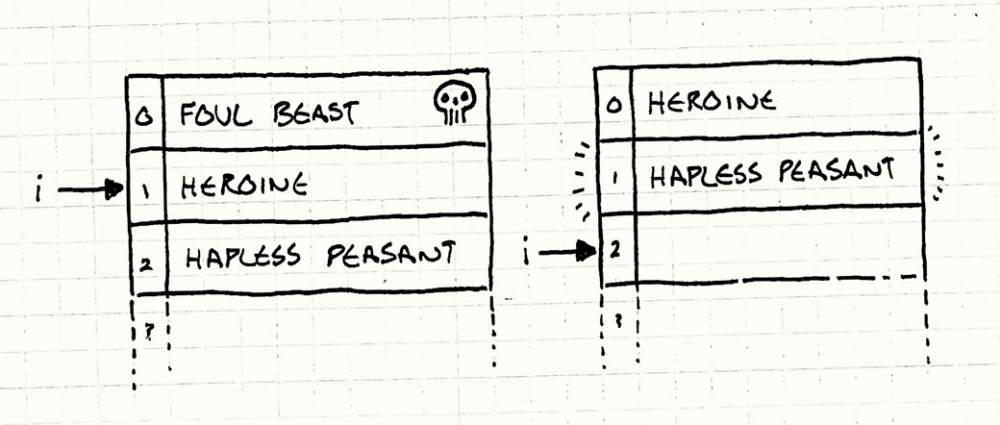
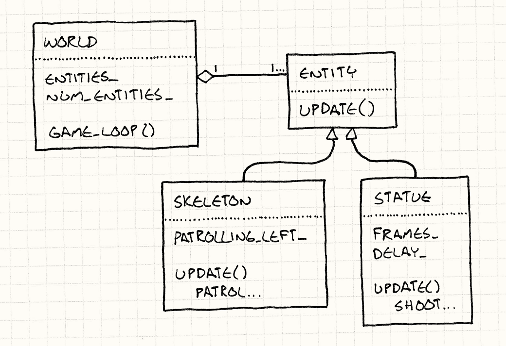

> **Source:** [https://gameprogrammingpatterns.com/update-method.html](https://gameprogrammingpatterns.com/update-method.html)
> **Section:** Sequencing Patterns
> **Book:** *Game Programming Patterns* by Robert Nystrom (gameprogrammingpatterns.com)
> **Note:** Mirrored locally for personal study. Not redistributed. Buy the book if you find it useful.

---

# Update Method

# [Game Programming Patterns](/)[Sequencing Patterns](sequencing-patterns.html)

## <a href="#intent" id="intent">Intent</a>

*Simulate a collection of independent objects by telling each to process one frame of behavior at a time.*

## <a href="#motivation" id="motivation">Motivation</a>

The player’s mighty valkyrie is on a quest to steal glorious jewels from where they rest on the bones of the long-dead sorcerer-king. She tentatively approaches the entrance of his magnificent crypt and is attacked by… *nothing*. No cursed statues shooting lightning at her. No undead warriors patrolling the entrance. She just walks right in and grabs the loot. Game over. You win.

Well, that won’t do.

This crypt needs some guards — enemies our brave heroine can grapple with. First up, we want a re-animated skeleton warrior to patrol back and forth in front of the door. If you ignore everything you probably already know about game programming, the simplest possible code to make that skeleton lurch back and forth is something like:

If the sorcerer-king wanted more intelligent behavior, he should have re-animated something that still had brain tissue.

    while (true)
    {
      // Patrol right.
      for (double x = 0; x < 100; x++)
      {
        skeleton.setX(x);
      }

      // Patrol left.
      for (double x = 100; x > 0; x--)
      {
        skeleton.setX(x);
      }
    }

The problem here, of course, is that the skeleton moves back and forth, but the player never sees it. The program is locked in an infinite loop, which is not exactly a fun gameplay experience. What we actually want is for the skeleton to move one step *each frame*.

We’ll have to remove those loops and rely on the outer game loop for iteration. That ensures the game keeps responding to user input and rendering while the guard is making his rounds. Like:

Naturally, <a href="game-loop.html" class="pattern">Game Loop</a> is another pattern in this book.

    Entity skeleton;
    bool patrollingLeft = false;
    double x = 0;

    // Main game loop:
    while (true)
    {
      if (patrollingLeft)
      {
        x--;
        if (x == 0) patrollingLeft = false;
      }
      else
      {
        x++;
        if (x == 100) patrollingLeft = true;
      }

      skeleton.setX(x);

      // Handle user input and render game...
    }

I did the before/after here to show you how the code gets more complex. Patrolling left and right used to be two simple `for` loops. It kept track of which direction the skeleton was moving implicitly by which loop was executing. Now that we have to yield to the outer game loop each frame and then resume where we left off, we have to track the direction explicitly using that `patrollingLeft` variable.

But this more or less works, so we keep going. A brainless bag of bones doesn’t give yon Norse maiden too much of a challenge, so the next thing we add is a couple of enchanted statues. These will fire bolts of lightning at her every so often to keep her on her toes.

Continuing our, “what’s the simplest way to code this” style, we end up with:

    // Skeleton variables...
    Entity leftStatue;
    Entity rightStatue;
    int leftStatueFrames = 0;
    int rightStatueFrames = 0;

    // Main game loop:
    while (true)
    {
      // Skeleton code...

      if (++leftStatueFrames == 90)
      {
        leftStatueFrames = 0;
        leftStatue.shootLightning();
      }

      if (++rightStatueFrames == 80)
      {
        rightStatueFrames = 0;
        rightStatue.shootLightning();
      }

      // Handle user input and render game...
    }

You can tell this isn’t trending towards code we’d enjoy maintaining. We’ve got an increasingly large pile of variables and imperative code all stuffed in the game loop, each handling one specific entity in the game. To get them all up and running at the same time, we’ve mushed their code together.

Anytime “mushed” accurately describes your architecture, you likely have a problem.

The pattern we’ll use to fix this is so simple you probably have it in mind already: *each entity in the game should encapsulate its own behavior.* This will keep the game loop uncluttered and make it easy to add and remove entities.

To do this, we need an *abstraction layer*, and we create that by defining an abstract `update()` method. The game loop maintains a collection of objects, but it doesn’t know their concrete types. All it knows is that they can be updated. This separates each object’s behavior both from the game loop and from the other objects.

Once per frame, the game loop walks the collection and calls `update()` on each object. This gives each one a chance to perform one frame’s worth of behavior. By calling it on all objects every frame, they all behave simultaneously.

Since some stickler will call me on this, yes, they don’t behave *truly concurrently*. While one object is updating, none of the others are. We’ll get into this more in a bit.

The game loop has a dynamic collection of objects, so adding and removing them from the level is easy — just add and remove them from the collection. Nothing is hardcoded anymore, and we can even populate the level using some kind of data file, which is exactly what our level designers want.

## <a href="#the-pattern" id="the-pattern">The Pattern</a>

The **game world** maintains a **collection of objects**. Each object implements an **update method** that **simulates one frame** of the object’s behavior. Each frame, the game updates every object in the collection.

## <a href="#when-to-use-it" id="when-to-use-it">When to Use It</a>

If the <a href="game-loop.html" class="pattern">Game Loop</a> pattern is the best thing since sliced bread, then the Update Method pattern is its butter. A wide swath of games featuring live entities that the player interacts with use this pattern in some form or other. If the game has space marines, dragons, Martians, ghosts, or athletes, there’s a good chance it uses this pattern.

However, if the game is more abstract and the moving pieces are less like living actors and more like pieces on a chessboard, this pattern is often a poor fit. In a game like chess, you don’t need to simulate all of the pieces concurrently, and you probably don’t need to tell the pawns to update themselves every frame.

You may not need to update their *behavior* each frame, but even in a board game, you may still want to update their *animation* every frame. This pattern can help with that too.

Update methods work well when:

- Your game has a number of objects or systems that need to run simultaneously.

- Each object’s behavior is mostly independent of the others.

- The objects need to be simulated over time.

## <a href="#keep-in-mind" id="keep-in-mind">Keep in Mind</a>

This pattern is pretty simple, so there aren’t a lot of hidden surprises in its dark corners. Still, every line of code has its ramifications.

### <a href="#splitting-code-into-single-frame-slices-makes-it-more-complex" id="splitting-code-into-single-frame-slices-makes-it-more-complex">Splitting code into single frame slices makes it more complex</a>

When you compare the first two chunks of code, the second is a good bit more complex. Both simply make the skeleton guard walk back and forth, but the second one does this while yielding control to the game loop each frame.

That change is almost always necessary to handle user input, rendering, and the other stuff that the game loop takes care of, so the first example wasn’t very practical. But it’s worth keeping in mind that there’s a big up front complexity cost when you julienne your behavioral code like this.

I say “almost” here because sometimes you can have your cake and eat it too. You can have straight-line code that never returns for your object behavior, while simultaneously having a number of objects running concurrently and coordinating with the game loop.

What you need is a system that lets you have multiple “threads” of execution going on at the same time. If the code for an object can pause and resume in the middle of what it’s doing, instead of having to *return* completely, you can write it in a more imperative form.

Actual threads are usually too heavyweight for this to work well, but if your language supports lightweight concurrency constructs like generators, coroutines, or fibers, you may be able to use those.

The <a href="bytecode.html" class="pattern">Bytecode</a> pattern is another option that creates threads of execution at the application level.

### <a href="#you-have-to-store-state-to-resume-where-you-left-off-each-frame" id="you-have-to-store-state-to-resume-where-you-left-off-each-frame">You have to store state to resume where you left off each frame</a>

In the first code sample, we didn’t have any variables to indicate whether the guard was moving left or right. That was implicit based on which code was currently executing.

When we changed this to a one-frame-at-a-time form, we had to create a `patrollingLeft` variable to track that. When we return out of the code, the execution position is lost, so we need to explicitly store enough information to restore it on the next frame.

The <a href="state.html" class="pattern">State</a> pattern can often help here. Part of the reason state machines are common in games is because (like their name implies) they store the kind of state that you need to pick up where you left off.

### <a href="#objects-all-simulate-each-frame-but-are-not-truly-concurrent" id="objects-all-simulate-each-frame-but-are-not-truly-concurrent">Objects all simulate each frame but are not truly concurrent</a>

In this pattern, the game loops over a collection of objects and updates each one. Inside the `update()` call, most objects are able to reach out and touch the rest of the game world, including other objects that are being updated. This means the *order* in which the objects are updated is significant.

If A comes before B in the list of objects, then when A updates, it will see B’s previous state. But when B updates, it will see A’s *new* state, since A has already been updated this frame. Even though from the player’s perspective, everything is moving at the same time, the core of the game is still turn-based. It’s just that a complete “turn” is only one frame long.

If, for some reason, you decide you *don’t* want your game to be sequential like this, you would need to use something like the <a href="double-buffer.html" class="pattern">Double Buffer</a> pattern. That makes the order in which A and B update not matter because *both* of them will see the previous frame’s state.

This is mostly a good thing as far as the game logic is concerned. Updating objects in parallel leads you to some unpleasant semantic corners. Imagine a game of chess where black and white moved at the same time. They both try to make a move that places a piece in the same currently empty square. How should this be resolved?

Updating sequentially solves this — each update incrementally changes the world from one valid state to the next with no period of time where things are ambiguous and need to be reconciled.

It also helps online play since you have a serialized set of moves that can be sent over the network.

### <a href="#be-careful-modifying-the-object-list-while-updating" id="be-careful-modifying-the-object-list-while-updating">Be careful modifying the object list while updating</a>

When you’re using this pattern, a lot of the game’s behavior ends up nestled in these update methods. That often includes code that adds or removes updatable objects from the game.

For example, say a skeleton guard drops an item when slain. With a new object, you can usually add it to the end of the list without too much trouble. You’ll keep iterating over that list and eventually get to the new one at the end and update it too.

But that does mean that the new object gets a chance to act during the frame that it was spawned, before the player has even had a chance to see it. If you don’t want that to happen, one simple fix is to cache the number of objects in the list at the beginning of the update loop and only update that many before stopping:

    int numObjectsThisTurn = numObjects_;
    for (int i = 0; i < numObjectsThisTurn; i++)
    {
      objects_[i]->update();
    }

Here, `objects_` is an array of the updatable objects in the game, and `numObjects_` is its length. When new objects are added, it gets incremented. We cache the length in `numObjectsThisTurn` at the beginning of the loop so that the iteration stops before we get to any new objects added during the current frame.

A hairier problem is when objects are *removed* while iterating. You vanquish some foul beast and now it needs to get yanked out of the object list. If it happens to be before the current object you’re updating in the list, you can accidentally skip an object:

    for (int i = 0; i < numObjects_; i++)
    {
      objects_[i]->update();
    }

This simple loop increments the index of the object being updated each iteration. The left side of the illustration below shows what the array looks like while we’re updating the heroine:

Since we’re updating her, `i` is 1. She slays the foul beast so it gets removed from the array. The heroine shifts up to 0, and the hapless peasant shifts up to 1. After updating the heroine, `i` is incremented to 2. As you can see on the right, the hapless peasant is skipped over and never gets updated.

A cheap solution is to walk the list *backwards* when you update. That way removing an object only shifts items that were already updated.

One fix is to just be careful when you remove objects and update any iteration variables to take the removal into account. Another is to defer removals until you’re done walking the list. Mark the object as “dead”, but leave it in place. During updating, make sure to skip any dead objects. Then, when that’s done, walk the list again to remove the corpses.

If you have multiple threads processing the items in the update loop, then you are even more likely to defer any modification to it to avoid costly thread synchronization during updates.

## <a href="#sample-code" id="sample-code">Sample Code</a>

This pattern is so straightforward that the sample code almost belabors the point. That doesn’t mean the pattern isn’t *useful*. It’s useful in part *because* it’s simple: it’s a clean solution to a problem without a lot of ornamentation.

But to keep things concrete, let’s walk through a basic implementation. We’ll start with an `Entity` class that will represent the skeletons and statues:

    class Entity
    {
    public:
      Entity()
      : x_(0), y_(0)
      {}

      virtual ~Entity() {}
      virtual void update() = 0;

      double x() const { return x_; }
      double y() const { return y_; }

      void setX(double x) { x_ = x; }
      void setY(double y) { y_ = y; }

    private:
      double x_;
      double y_;
    };

I stuck a few things in there, but just the bare minimum we’ll need later. Presumably in real code, there’d be lots of other stuff like graphics and physics. The important bit for this pattern is that it has an abstract `update()` method.

The game maintains a collection of these entities. In our sample, we’ll put that in a class representing the game world:

    class World
    {
    public:
      World()
      : numEntities_(0)
      {}

      void gameLoop();

    private:
      Entity* entities_[MAX_ENTITIES];
      int numEntities_;
    };

In a real-world program, you’d probably use an actual collection class, but I’m just using a vanilla array here to keep things simple.

Now that everything is set up, the game implements the pattern by updating each entity every frame:

    void World::gameLoop()
    {
      while (true)
      {
        // Handle user input...

        // Update each entity.
        for (int i = 0; i < numEntities_; i++)
        {
          entities_[i]->update();
        }

        // Physics and rendering...
      }
    }

As the name of the method implies, this is an example of the <a href="game-loop.html" class="pattern">Game Loop</a> pattern.

### <a href="#subclassing-entities" id="subclassing-entities">Subclassing entities?!</a>

There are some readers whose skin is crawling right now because I’m using inheritance on the main `Entity` class to define different behaviors. If you don’t happen to see the problem, I’ll provide some context.

When the game industry emerged from the primordial seas of 6502 assembly code and VBLANKs onto the shores of object-oriented languages, developers went into a software architecture fad frenzy. One of the biggest was using inheritance. Towering, Byzantine class hierarchies were built, big enough to blot out the sun.

It turns out that was a terrible idea and no one can maintain a giant class hierarchy without it crumbling around them. Even the Gang of Four knew this in 1994 when they wrote:

> Favor ‘object composition’ over ‘class inheritance’.

Between you and me, I think the pendulum has swung a bit too far *away* from subclassing. I generally avoid it, but being dogmatic about *not* using inheritance is as bad as being dogmatic about using it. You can use it in moderation without having to be a teetotaler.

When this realization percolated through the game industry, the solution that emerged was the <a href="component.html" class="pattern">Component</a> pattern. Using that, `update()` would be on the entity’s *components* and not on `Entity` itself. That lets you avoid creating complicated class hierarchies of entities to define and reuse behavior. Instead, you just mix and match components.

If I were making a real game, I’d probably do that too. But this chapter isn’t about components. It’s about `update()` methods, and the simplest way I can show them, with as few moving parts as possible, is by putting that method right on `Entity` and making a few subclasses.

<a href="component.html" class="pattern">This one</a> is.

### <a href="#defining-entities" id="defining-entities">Defining entities</a>

OK, back to the task at hand. Our original motivation was to be able to define a patrolling skeleton guard and some lightning-bolt-unleashing magical statues. Let’s start with our bony friend. To define his patrolling behavior, we make a new entity that implements `update()` appropriately:

    class Skeleton : public Entity
    {
    public:
      Skeleton()
      : patrollingLeft_(false)
      {}

      virtual void update()
      {
        if (patrollingLeft_)
        {
          setX(x() - 1);
          if (x() == 0) patrollingLeft_ = false;
        }
        else
        {
          setX(x() + 1);
          if (x() == 100) patrollingLeft_ = true;
        }
      }

    private:
      bool patrollingLeft_;
    };

As you can see, we pretty much just cut that chunk of code from the game loop earlier in the chapter and pasted it into `Skeleton`’s `update()` method. The one minor difference is that `patrollingLeft_` has been made into a field instead of a local variable. That way, its value sticks around between calls to `update()`.

Let’s do this again with the statue:

    class Statue : public Entity
    {
    public:
      Statue(int delay)
      : frames_(0),
        delay_(delay)
      {}

      virtual void update()
      {
        if (++frames_ == delay_)
        {
          shootLightning();

          // Reset the timer.
          frames_ = 0;
        }
      }

    private:
      int frames_;
      int delay_;

      void shootLightning()
      {
        // Shoot the lightning...
      }
    };

Again, most of the change is moving code from the game loop into the class and renaming some stuff. In this case, though, we’ve actually made the codebase simpler. In the original nasty imperative code, there were separate local variables for each statue’s frame counter and rate of fire.

Now that those have been moved into the `Statue` class itself, you can create as many as you want and each instance will have its own little timer. That’s really the motivation behind this pattern — it’s now much easier to add new entities to the game world because each one brings along everything it needs to take care of itself.

This pattern lets us separate *populating* the game world from *implementing* it. This in turn gives us the flexibility to populate the world using something like a separate data file or level editor.

Do people still care about UML? If so, here’s what we just created.

### <a href="#passing-time" id="passing-time">Passing time</a>

That’s the key pattern, but I’ll just touch on a common refinement. So far, we’ve assumed every call to `update()` advances the state of the game world by the same fixed unit of time.

I happen to prefer that, but many games use a *variable time step*. In those, each turn of the game loop may simulate a larger or smaller slice of time depending on how long it took to process and render the previous frame.

The <a href="game-loop.html" class="pattern">Game Loop</a> chapter has a lot more on the advantages and disadvantages of fixed and variable time steps.

That means that each `update()` call needs to know how far the hand of the virtual clock has swung, so you’ll often see the elapsed time passed in. For example, we can make our patrolling skeleton handle a variable time step like so:

    void Skeleton::update(double elapsed)
    {
      if (patrollingLeft_)
      {
        x -= elapsed;
        if (x <= 0)
        {
          patrollingLeft_ = false;
          x = -x;
        }
      }
      else
      {
        x += elapsed;
        if (x >= 100)
        {
          patrollingLeft_ = true;
          x = 100 - (x - 100);
        }
      }
    }

Now, the distance the skeleton moves increases as the elapsed time grows. You can also see the additional complexity of dealing with a variable time step. The skeleton may overshoot the bounds of its patrol with a large time slice, and we have to handle that carefully.

## <a href="#design-decisions" id="design-decisions">Design Decisions</a>

With a simple pattern like this, there isn’t too much variation, but there are still a couple of knobs you can turn.

### <a href="#what-class-does-the-update-method-live-on" id="what-class-does-the-update-method-live-on">What class does the update method live on?</a>

The most obvious and most important decision you’ll make is what class to put `update()` on.

- **The entity class:**

  This is the simplest option if you already have an entity class since it doesn’t bring any additional classes into play. This may work if you don’t have too many kinds of entities, but the industry is generally moving away from this.

  Having to subclass `Entity` every time you want a new behavior is brittle and painful when you have a large number of different kinds. You’ll eventually find yourself wanting to reuse pieces of code in a way that doesn’t gracefully map to a single inheritance hierarchy, and then you’re stuck.

- **The component class:**

  If you’re already using the <a href="component.html" class="pattern">Component</a> pattern, this is a no-brainer. It lets each component update itself independently. In the same way that the Update Method pattern in general lets you decouple game entities from each other in the game world, this lets you decouple *parts of a single entity* from each other. Rendering, physics, and AI can all take care of themselves.

- **A delegate class:**

  There are other patterns that involve delegating part of a class’s behavior to another object. The <a href="state.html" class="pattern">State</a> pattern does this so that you can change an object’s behavior by changing what it delegates to. The <a href="type-object.html" class="pattern">Type Object</a> pattern does this so that you can share behavior across a bunch of entities of the same “kind”.

  If you’re using one of those patterns, it’s natural to put `update()` on that delegated class. In that case, you may still have the `update()` method on the main class, but it will be non-virtual and will simply forward to the delegated object. Something like:

  

      void Entity::update()
      {
        // Forward to state object.
        state_->update();
      }

  

  Doing this lets you define new behavior by changing out the delegated object. Like using components, it gives you the flexibility to change behavior without having to define an entirely new subclass.

### <a href="#how-are-dormant-objects-handled" id="how-are-dormant-objects-handled">How are dormant objects handled?</a>

You often have a number of objects in the world that, for whatever reason, temporarily don’t need to be updated. They could be disabled, or off-screen, or not unlocked yet. If a large number of objects are in this state, it can be a waste of CPU cycles to walk over them each frame only to do nothing.

One alternative is to maintain a separate collection of just the “live” objects that do need updating. When an object is disabled, it’s removed from the collection. When it gets re-enabled, it’s added back. This way, you only iterate over items that actually have real work do to.

- **If you use a single collection containing inactive objects:**

  - *You waste time*. For inactive objects, you’ll end up either checking some “am I enabled” flag or calling a method that does nothing.

    In addition to wasted CPU cycles checking if the object is enabled and skipping past it, pointlessly iterating over objects can blow your data cache. CPUs optimize reads by loading memory from RAM into much faster on-chip caches. They do this speculatively by assuming you’re likely to read memory right after a location you just read.

    When you skip over an object, you can skip past the end of the cache, forcing it to go and slowly pull in another chunk of main memory.

- **If you use a separate collection of only active objects:**

  - *You use extra memory to maintain the second collection.* There’s still usually another master collection of all entities for cases where you need them all. In that case, this collection is technically redundant. When speed is tighter than memory (which it often is), this can still be a worthwhile trade-off.

    Another option to mitigate this is to have two collections, but have the other collection only contain the *inactive* entities instead of all of them.

  - *You have to keep the collections in sync.* When objects are created or completely destroyed (and not just made temporarily inactive), you have to remember to modify both the master collection and active object one.

The metric that should guide your approach here is how many inactive objects you tend to have. The more you have, the more useful it is to have a separate collection that avoids them during your core game loop.

## <a href="#see-also" id="see-also">See Also</a>

- This pattern, along with <a href="game-loop.html" class="pattern">Game Loop</a> and <a href="component.html" class="pattern">Component</a>, is part of a trinity that often forms the nucleus of a game engine.

- When you start caring about the cache performance of updating a bunch of entities or components in a loop each frame, the <a href="data-locality.html" class="pattern">Data Locality</a> pattern can help make that faster.

- The [Unity](http://unity3d.com) framework uses this pattern in several classes, including [`MonoBehaviour`](http://docs.unity3d.com/Documentation/ScriptReference/MonoBehaviour.Update.html).

- Microsoft’s [XNA](http://creators.xna.com/en-US/) platform uses this pattern both in the [`Game`](http://msdn.microsoft.com/en-us/library/microsoft.xna.framework.game.update.aspx) and [`GameComponent`](http://msdn.microsoft.com/en-us/library/microsoft.xna.framework.gamecomponent.update.aspx) classes.

- The [Quintus](http://html5quintus.com/) JavaScript game engine uses this pattern on its main [`Sprite`](http://html5quintus.com/guide/sprites.md) class.

← [Previous Chapter](game-loop.html)

 

≡ [About The Book](/)

 

§ [Contents](/contents.html)

 

[Next Chapter](behavioral-patterns.html) →

© 2009-2021 Robert Nystrom
